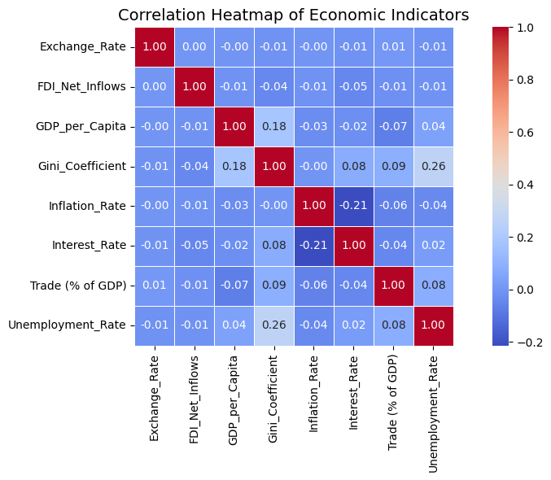

# 🌍 Global Economic Indicators Analysis

An analysis of how macroeconomic indicators such as inflation, interest rates, GDP per capita, unemployment and income inequality relate to one another across countries, using World Bank data from 2000 to 2023. The window deliberately spans the Dot-Com Bubble, the 2008 Financial Crisis, the Eurozone Debt Crisis and COVID-19, so the data captures how economies respond to shocks.

**Key results**

- Global indicators are only weakly correlated: the strongest links were inequality with unemployment (+0.26) and interest rates inversely with inflation (-0.21)
- GDP per capita barely predicted inequality (+0.18) or unemployment (+0.04), so wealth alone says little about economic structure
- The COVID recovery was uneven: China and the US recorded the largest GDP per capita gains while Germany and Japan lagged

📄 **Full analysis, figures and references:** [Economic_Indicators_Report.pdf](Economic_Indicators_Report.pdf)

## Why this project

Investors, governments and institutions all rely on these indicators to make decisions, and I wanted to test how much they actually move together across countries rather than assuming textbook relationships hold globally. The most interesting finding was how weakly most indicators correlate at a global level: GDP per capita barely predicted inequality or unemployment, while the strongest links (inequality with unemployment, interest rates inversely with inflation) were modest at best. The pre- versus post-COVID comparison also showed a genuinely uneven recovery, with China and the US pulling ahead while developed economies like Germany and Japan lagged. It was a useful reminder that global averages hide more than they reveal, and that country-level analysis matters for anyone allocating capital.

## Method

I sourced the data from World Bank Open Data after rejecting smaller datasets with inconsistent timeframes, cleaned it in pandas (converting placeholder values to NaNs and imputing with medians rather than means, since medians resist extreme values), and reshaped it from long to wide format so each country-year became a row and each indicator a column. I then analysed the data through a Pearson correlation heatmap, a pre/post-COVID GDP per capita comparison across the top 20 countries, and an interactive Plotly radar chart comparing the economic profiles of China and the US.

## Skills used

- **Data wrangling in pandas**: cleaning, imputation strategy, melt/pivot reshaping of a real-world dataset
- **Exploratory data analysis**: correlation analysis, cross-sectional and longitudinal comparison
- **Visualisation**: heatmaps (Seaborn), comparative bar charts (Matplotlib), interactive radar charts (Plotly)
- **Economic interpretation**: connecting statistical patterns to monetary policy, labour markets and investor behaviour
- **Research judgement**: evaluating and rejecting unsuitable data sources, documenting decisions in a written report

The workflow mirrors the day-to-day of an analytics or research role: take messy public data, make defensible cleaning decisions, and turn it into insights a stakeholder can act on.

## 🔌 Running the Project

Install dependencies with `pip install pandas matplotlib seaborn plotly`, then open `economic_indicators_analysis.ipynb` in Jupyter. The notebook reads `Economic_Indicators.csv`, included in the repository. Note the Plotly chart is interactive and does not render in GitHub's preview.

## 🙏 Acknowledgments

Data sourced from [World Bank Open Data](https://data.worldbank.org/). The cleaning and visualisation approach drew on W3Schools, Stack Overflow, Plotly documentation, and analysis notebooks by Zabihullah18 and A. Mulla; full references are in the [report](Economic_Indicators_Report.pdf).
